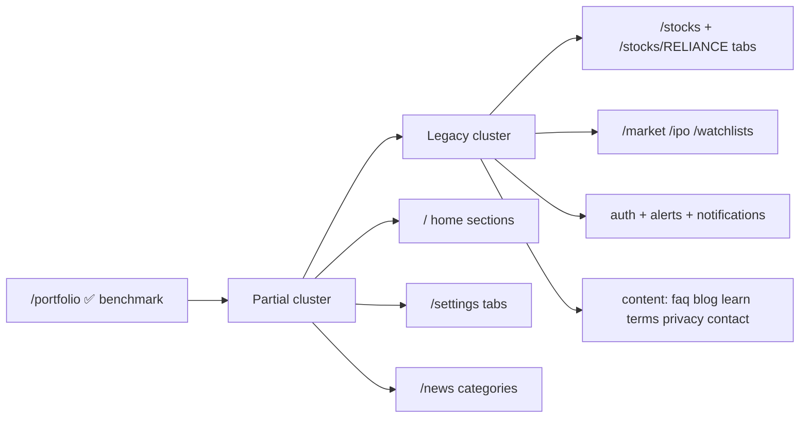

# Design Coverage Matrix

> Generated: 2026-08-23T10:23:36.667Z
> Benchmark: `src/components/portfolio/PortfolioDashboard.tsx`
> Brief: `docs/new_design.md`

## Summary

| Status | Count | Meaning |
| --- | ---: | --- |
| implemented (completed) | 25 | Matches portfolio `panelShellClass` language |
| partial (in progress) | 6 | Some new patterns, inconsistent surfaces |
| legacy | 17 | `glass-card`, `PageBackground`, or monolithic old UI |
| not-started | 13 | No design tokens detected yet |
| **remaining** | **36** | legacy + partial + not-started |
| skip-visual | 3 | Redirects or non-UI routes |

## Route Status (sorted by priority)

| Route | Status | Score | Signals | Screenshot (light) |
| --- | --- | ---: | --- | --- |
| `/blog` | legacy | 20 | PageBackground | docs\design-audit\screenshots\light\blog.png |
| `/contact` | legacy | 5 | PageBackground, neon-accent | docs\design-audit\screenshots\light\contact.png |
| `/faq` | legacy | 5 | PageBackground, neon-accent | docs\design-audit\screenshots\light\faq.png |
| `/learn` | legacy | 5 | PageBackground, neon-accent | docs\design-audit\screenshots\light\learn.png |
| `/privacy` | legacy | 20 | PageBackground | docs\design-audit\screenshots\light\privacy.png |
| `/stocks/RELIANCE?tab=esg` | legacy | 30 | glass-card, stock-details-page | docs\design-audit\screenshots\light\stocks-RELIANCE-tab-esg.png |
| `/stocks/RELIANCE?tab=fundamental` | legacy | 30 | glass-card, stock-details-page | docs\design-audit\screenshots\light\stocks-RELIANCE-tab-fundamental.png |
| `/stocks/RELIANCE?tab=growth` | legacy | 30 | glass-card, stock-details-page | docs\design-audit\screenshots\light\stocks-RELIANCE-tab-growth.png |
| `/stocks/RELIANCE?tab=industry` | legacy | 30 | glass-card, stock-details-page | docs\design-audit\screenshots\light\stocks-RELIANCE-tab-industry.png |
| `/stocks/RELIANCE?tab=institutional` | legacy | 30 | glass-card, stock-details-page | docs\design-audit\screenshots\light\stocks-RELIANCE-tab-institutional.png |
| `/stocks/RELIANCE?tab=macroeconomic` | legacy | 30 | glass-card, stock-details-page | docs\design-audit\screenshots\light\stocks-RELIANCE-tab-macroeconomic.png |
| `/stocks/RELIANCE?tab=management` | legacy | 30 | glass-card, stock-details-page | docs\design-audit\screenshots\light\stocks-RELIANCE-tab-management.png |
| `/stocks/RELIANCE?tab=overview` | legacy | 30 | glass-card, stock-details-page | docs\design-audit\screenshots\light\stocks-RELIANCE-tab-overview.png |
| `/stocks/RELIANCE?tab=risk` | legacy | 30 | glass-card, stock-details-page | docs\design-audit\screenshots\light\stocks-RELIANCE-tab-risk.png |
| `/stocks/RELIANCE?tab=sentiment` | legacy | 30 | glass-card, stock-details-page | docs\design-audit\screenshots\light\stocks-RELIANCE-tab-sentiment.png |
| `/stocks/RELIANCE?tab=technical` | legacy | 30 | glass-card, stock-details-page | docs\design-audit\screenshots\light\stocks-RELIANCE-tab-technical.png |
| `/terms` | legacy | 5 | PageBackground, neon-accent | docs\design-audit\screenshots\light\terms.png |
| `/news/alerts` | partial | 60 | news-shell | docs\design-audit\screenshots\light\news-alerts.png |
| `/news/companies` | partial | 60 | news-shell | docs\design-audit\screenshots\light\news-companies.png |
| `/news/economy` | partial | 60 | news-shell | docs\design-audit\screenshots\light\news-economy.png |
| `/news/markets` | partial | 60 | news-shell | docs\design-audit\screenshots\light\news-markets.png |
| `/news/trending` | partial | 60 | news-shell | docs\design-audit\screenshots\light\news-trending.png |
| `/stocks/[symbol]` | partial | 75 | panel-shell, neon-accent | docs\design-audit\screenshots\light\stocks-RELIANCE.png |
| `/_not-found` | not-started | 50 |  | docs\design-audit\screenshots\light\_not-found.png |
| `/about` | not-started | 50 |  | docs\design-audit\screenshots\light\about.png |
| `/accessibility` | not-started | 50 |  | docs\design-audit\screenshots\light\accessibility.png |
| `/api-docs` | not-started | 50 |  | docs\design-audit\screenshots\light\api-docs.png |
| `/api-test` | not-started | 50 |  | docs\design-audit\screenshots\light\api-test.png |
| `/auth/forgot-password` | not-started | 50 |  | docs\design-audit\screenshots\light\auth-forgot-password.png |
| `/auth/reset-password` | not-started | 50 |  | docs\design-audit\screenshots\light\auth-reset-password.png |
| `/auth/sessions` | not-started | 50 |  | docs\design-audit\screenshots\light\auth-sessions.png |
| `/auth/verify-email` | not-started | 50 |  | docs\design-audit\screenshots\light\auth-verify-email.png |
| `/auth/verify-reset-code` | not-started | 50 |  | docs\design-audit\screenshots\light\auth-verify-reset-code.png |
| `/login` | not-started | 50 |  | docs\design-audit\screenshots\light\login.png |
| `/signup` | not-started | 50 |  | docs\design-audit\screenshots\light\signup.png |
| `/sitemap` | not-started | 50 |  | docs\design-audit\screenshots\light\sitemap.png |
| `/` | implemented | 100 | panel-shell, premium-type, home-section | docs\design-audit\screenshots\light\home.png |
| `/alerts` | implemented | 90 | tool-shell | docs\design-audit\screenshots\light\alerts.png |
| `/ipo` | implemented | 90 | panel-shell | docs\design-audit\screenshots\light\ipo.png |
| `/ipo/[ipoId]` | implemented | 90 | panel-shell | docs\design-audit\screenshots\light\ipo-sample-ipo.png |
| `/market` | implemented | 90 | panel-shell | docs\design-audit\screenshots\light\market.png |
| `/market/institutional` | implemented | 90 | panel-shell | docs\design-audit\screenshots\light\market-institutional.png |
| `/news` | implemented | 85 | panel-shell, news-shell, neon-accent | docs\design-audit\screenshots\light\news.png |
| `/news` | implemented | 100 | panel-shell, news-shell | docs\design-audit\screenshots\light\news.png |
| `/news/alerts` | implemented | 100 | panel-shell, news-shell | docs\design-audit\screenshots\light\news-alerts.png |
| `/news/companies` | implemented | 100 | panel-shell, news-shell | docs\design-audit\screenshots\light\news-companies.png |
| `/news/economy` | implemented | 100 | panel-shell, news-shell | docs\design-audit\screenshots\light\news-economy.png |
| `/news/markets` | implemented | 100 | panel-shell, news-shell | docs\design-audit\screenshots\light\news-markets.png |
| `/news/trending` | implemented | 100 | panel-shell, news-shell | docs\design-audit\screenshots\light\news-trending.png |
| `/notifications` | implemented | 90 | tool-shell | docs\design-audit\screenshots\light\notifications.png |
| `/portfolio` | implemented | 100 | portfolio-benchmark | docs\design-audit\screenshots\light\portfolio.png |
| `/settings` | implemented | 90 | panel-shell | docs\design-audit\screenshots\light\settings.png |
| `/settings?tab=basic` | implemented | 90 | panel-shell | docs\design-audit\screenshots\light\settings-tab-basic.png |
| `/settings?tab=devices` | implemented | 90 | panel-shell | docs\design-audit\screenshots\light\settings-tab-devices.png |
| `/settings?tab=password` | implemented | 90 | panel-shell | docs\design-audit\screenshots\light\settings-tab-password.png |
| `/settings?tab=reports` | implemented | 90 | panel-shell | docs\design-audit\screenshots\light\settings-tab-reports.png |
| `/settings?tab=suspicious` | implemented | 90 | panel-shell | docs\design-audit\screenshots\light\settings-tab-suspicious.png |
| `/settings?tab=trading` | implemented | 90 | panel-shell | docs\design-audit\screenshots\light\settings-tab-trading.png |
| `/stock-search` | implemented | 90 | panel-shell | docs\design-audit\screenshots\light\stock-search.png |
| `/stocks` | implemented | 90 | panel-shell | docs\design-audit\screenshots\light\stocks.png |
| `/watchlists` | implemented | 90 | tool-shell | docs\design-audit\screenshots\light\watchlists.png |
| `/auth/login` | skip-visual | - | redirect-or-non-ui | - |
| `/auth/profile` | skip-visual | - | redirect-or-non-ui | - |
| `/auth/register` | skip-visual | - | redirect-or-non-ui | - |

## Visual flow — pages needing redesign

## Remaining work (action list)

- [ ] `/blog` — **legacy**; file: `src/app/blog/page.tsx`
- [ ] `/contact` — **legacy**; file: `src/app/contact/page.tsx`
- [ ] `/faq` — **legacy**; file: `src/app/faq/page.tsx`
- [ ] `/learn` — **legacy**; file: `src/app/learn/page.tsx`
- [ ] `/privacy` — **legacy**; file: `src/app/privacy/page.tsx`
- [ ] `/stocks/RELIANCE?tab=esg` — **legacy**; file: `src/app/stocks/[symbol]/page.tsx`
- [ ] `/stocks/RELIANCE?tab=fundamental` — **legacy**; file: `src/app/stocks/[symbol]/page.tsx`
- [ ] `/stocks/RELIANCE?tab=growth` — **legacy**; file: `src/app/stocks/[symbol]/page.tsx`
- [ ] `/stocks/RELIANCE?tab=industry` — **legacy**; file: `src/app/stocks/[symbol]/page.tsx`
- [ ] `/stocks/RELIANCE?tab=institutional` — **legacy**; file: `src/app/stocks/[symbol]/page.tsx`
- [ ] `/stocks/RELIANCE?tab=macroeconomic` — **legacy**; file: `src/app/stocks/[symbol]/page.tsx`
- [ ] `/stocks/RELIANCE?tab=management` — **legacy**; file: `src/app/stocks/[symbol]/page.tsx`
- [ ] `/stocks/RELIANCE?tab=overview` — **legacy**; file: `src/app/stocks/[symbol]/page.tsx`
- [ ] `/stocks/RELIANCE?tab=risk` — **legacy**; file: `src/app/stocks/[symbol]/page.tsx`
- [ ] `/stocks/RELIANCE?tab=sentiment` — **legacy**; file: `src/app/stocks/[symbol]/page.tsx`
- [ ] `/stocks/RELIANCE?tab=technical` — **legacy**; file: `src/app/stocks/[symbol]/page.tsx`
- [ ] `/terms` — **legacy**; file: `src/app/terms/page.tsx`
- [ ] `/news/alerts` — **partial**; file: `src/app/news/alerts/page.tsx`
- [ ] `/news/companies` — **partial**; file: `src/app/news/companies/page.tsx`
- [ ] `/news/economy` — **partial**; file: `src/app/news/economy/page.tsx`
- [ ] `/news/markets` — **partial**; file: `src/app/news/markets/page.tsx`
- [ ] `/news/trending` — **partial**; file: `src/app/news/trending/page.tsx`
- [ ] `/stocks/[symbol]` — **partial**; file: `src/app/stocks/[symbol]/page.tsx`
- [ ] `/_not-found` — **not-started**; file: `src/app/not-found.tsx`
- [ ] `/about` — **not-started**; file: `src/app/about/page.tsx`
- [ ] `/accessibility` — **not-started**; file: `src/app/accessibility/page.tsx`
- [ ] `/api-docs` — **not-started**; file: `src/app/api-docs/page.tsx`
- [ ] `/api-test` — **not-started**; file: `src/app/api-test/page.tsx`
- [ ] `/auth/forgot-password` — **not-started**; file: `src/app/auth/forgot-password/page.tsx`
- [ ] `/auth/reset-password` — **not-started**; file: `src/app/auth/reset-password/page.tsx`
- [ ] `/auth/sessions` — **not-started**; file: `src/app/auth/sessions/page.tsx`
- [ ] `/auth/verify-email` — **not-started**; file: `src/app/auth/verify-email/page.tsx`
- [ ] `/auth/verify-reset-code` — **not-started**; file: `src/app/auth/verify-reset-code/page.tsx`
- [ ] `/login` — **not-started**; file: `src/app/login/page.tsx`
- [ ] `/signup` — **not-started**; file: `src/app/signup/page.tsx`
- [ ] `/sitemap` — **not-started**; file: `src/app/sitemap/page.tsx`