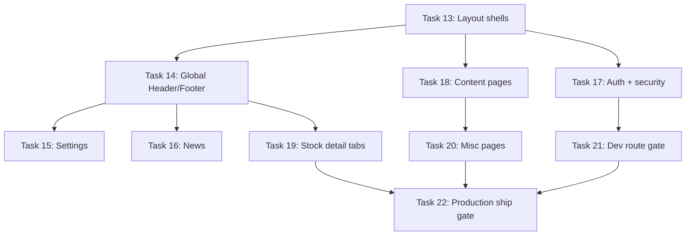

# Production Design Rollout — Remaining Routes Implementation Plan

> **For agentic workers:** REQUIRED SUB-SKILL: Use superpowers:subagent-driven-development (recommended) or superpowers:executing-plans to implement this plan task-by-task. Steps use checkbox (`- [ ]`) syntax for tracking.

**Goal:** Finish the `docs/new_design.md` rollout on all remaining routes (50 remaining as of Task 12), unify global shell chrome, and pass production ship gates (build, design audit, auth security basics, dev-route gating).

**Architecture:** Modular monolith frontend — one shared token module (`src/styles/design-tokens.ts`), three thin page shells (`ToolPageLayout` ✅, new `AuthPageLayout`, new `ContentPageLayout`), in-place upgrades for Settings/News/Stock detail. No new CSS framework, no design-token duplication. Shell (Header/Footer/AppShell) gets token pass first so every cluster inherits polish. Dev-only routes (`/api-test`, `/api-docs`) gated at the page layer — no middleware file exists today (ponytail: page guard beats new infra).

**Tech Stack:** Next.js 16 App Router, React 18, TypeScript 5, Tailwind CSS 3, existing `design-tokens.ts`, Node `node:test` for audit scripts, Playwright screenshots via `npm run audit:design:full`.

## Global Constraints

- Design brief: premium, minimal, Apple-inspired; emerald green accent; no noisy gradients; portfolio page is quality reference (`docs/new_design.md`).
- Preserve all routes, API behavior, and business logic unless a UI refactor requires a safe layout adjustment.
- Run npm commands from `Stock-Sense-main/` (no workspace-root `package.json`); quote paths with spaces.
- Use `npm` (not pnpm); verify scripts against `package.json`.
- Frontend has no Jest/Vitest script; use `node --test` for audit-script checks only.
- Light and dark mode must both look correct on every shipped route.
- Accessibility: semantic headings, label/input pairs, visible focus rings (`focus:ring-emerald-500/30`), keyboard-navigable controls.
- **Ponytail rule:** Reuse existing shells and tokens; do not add Radix/shadcn wrappers for pages that already work. Delete dead code when found (`StocksClient.tsx` is unused — grep confirms zero imports).
- **Production SLO targets (ship gate):** LCP ≤ 2.5s on `/` and `/portfolio` (mobile throttling, Lighthouse); INP ≤ 200ms; CLS ≤ 0.1; zero `legacy`/`not-started` on user-facing routes in design matrix.

---

## Current State (2026-08-23, post Task 12)

| Status | Count | Examples |
| --- | ---: | --- |
| **implemented** | 11 | `/`, `/portfolio`, `/stocks`, `/market`, `/ipo`, `/watchlists`, `/alerts`, `/notifications` |
| **partial** | 19 | `/settings*`, `/news*`, `/stocks/[symbol]` |
| **legacy** | 17 | content pages (`PageBackground`), stock subtabs (neon/glass signals) |
| **not-started** | 14 | auth, `/about`, dev misc |
| **remaining** | **50** | partial + legacy + not-started |

**Completed:** Phase 0 (Tasks 1–5), Phase 1 Task 6, Phase 2 Tasks 7–12.

---

## File Structure (remaining work)

| File | Responsibility |
| --- | --- |
| `src/styles/design-tokens.ts` | Shared class strings (exists; may add `tabActiveClass`, `linkClass`) |
| `src/components/tools/ToolPageLayout.tsx` | User tools shell ✅ |
| `src/components/auth/AuthPageLayout.tsx` | **Create** — centered panel for login/signup/reset flows |
| `src/components/content/ContentPageLayout.tsx` | **Create** — replaces `PageBackground` on marketing/content pages |
| `src/components/layout/Header.tsx` | Global nav — token + emerald accent pass |
| `src/components/layout/Footer.tsx` | Global footer — token pass |
| `src/components/layout/AppShell.tsx` | Page wrapper — remove legacy gradient assumptions |
| `src/components/layout/PageBackground.tsx` | **Delete usage**, then file if zero imports remain |
| `src/components/settings/SettingsPageShell.tsx` | Upgrade `rounded-[22px]` → `panelShellClass` |
| `src/components/settings/*.tsx` | Tab panels inherit shell tokens |
| `src/components/News/NewsCategoryTabs.tsx` | Tab bar → emerald tokens, remove neon |
| `src/app/stocks/[symbol]/page.tsx` | Finish tab chrome (neon → emerald) |
| `src/components/stocks/*.tsx` | Replace scattered `bg-neon-400` dots/badges |
| `src/app/stocks/[symbol]/StocksClient.tsx` | **Delete** (dead duplicate) |
| `scripts/design-audit/design-heuristics.mjs` | Add `auth-shell`, `content-shell`, `settings-implemented` signals |
| `src/app/api-test/page.tsx` | Production gate redirect |
| `src/app/api-docs/page.tsx` | Production gate redirect |

---

## Rollout Order (ponytail-optimized)

Shell and shared layouts first → clusters → stock tabs → ship gate.



---

### Task 13: Auth + Content Page Shells

**Files:**
- Create: `src/components/auth/AuthPageLayout.tsx`
- Create: `src/components/content/ContentPageLayout.tsx`
- Modify: `src/styles/design-tokens.ts` (add tab/link helpers if missing)
- Test: `scripts/design-audit/__tests__/design-heuristics.test.mjs`

**Interfaces:**
- Consumes: `panelShellClass`, `sectionTitleClass`, `sectionEyebrowClass`, `fieldClass`, `primaryButtonClass` from `@/styles/design-tokens`
- Produces: `AuthPageLayout({ title, description, children })`, `ContentPageLayout({ eyebrow, title, description, children })`

- [ ] **Step 1: Write failing heuristic tests**

```javascript
// Append to scripts/design-audit/__tests__/design-heuristics.test.mjs
test('AuthPageLayout route scores as implemented', () => {
  const sample = `import { AuthPageLayout } from '@/components/auth/AuthPageLayout';`;
  const result = classifyRouteDesign(sample, 'src/app/login/page.tsx');
  assert.equal(result.status, DESIGN_STATUS.IMPLEMENTED);
  assert.ok(result.signals.includes('auth-shell'));
});

test('ContentPageLayout route scores as implemented', () => {
  const sample = `import { ContentPageLayout } from '@/components/content/ContentPageLayout';`;
  const result = classifyRouteDesign(sample, 'src/app/faq/page.tsx');
  assert.equal(result.status, DESIGN_STATUS.IMPLEMENTED);
  assert.ok(result.signals.includes('content-shell'));
});
```

- [ ] **Step 2: Run tests — expect FAIL**

Run: `cd "C:/Users/khush/Desktop/Projects/stock-sense/Stock-Sense-main" && node --test scripts/design-audit/__tests__/design-heuristics.test.mjs`
Expected: FAIL — status `not-started`, missing `auth-shell` / `content-shell` signals

- [ ] **Step 3: Add heuristic signals**

```javascript
// scripts/design-audit/design-heuristics.mjs — add to IMPLEMENTED_SIGNALS array
{ pattern: /AuthPageLayout/, weight: 40, label: 'auth-shell' },
{ pattern: /ContentPageLayout/, weight: 40, label: 'content-shell' },
```

- [ ] **Step 4: Create AuthPageLayout**

```tsx
// src/components/auth/AuthPageLayout.tsx
import type { ReactNode } from 'react';
import { panelShellClass, sectionTitleClass } from '@/styles/design-tokens';

type AuthPageLayoutProps = {
  title: string;
  description?: string;
  children: ReactNode;
};

export function AuthPageLayout({ title, description, children }: AuthPageLayoutProps) {
  return (
    <div className="relative flex min-h-screen items-center justify-center px-4 py-10 text-slate-950 dark:text-white">
      <div className={`${panelShellClass} w-full max-w-md p-8 sm:p-10`}>
        <h1 className={sectionTitleClass}>{title}</h1>
        {description ? (
          <p className="mt-3 text-sm leading-6 text-slate-600 dark:text-slate-400">{description}</p>
        ) : null}
        <div className="mt-6">{children}</div>
      </div>
    </div>
  );
}
```

- [ ] **Step 5: Create ContentPageLayout**

```tsx
// src/components/content/ContentPageLayout.tsx
import type { ReactNode } from 'react';
import { panelShellClass, sectionEyebrowClass, sectionTitleClass } from '@/styles/design-tokens';

type ContentPageLayoutProps = {
  eyebrow: string;
  title: string;
  description?: string;
  children: ReactNode;
};

export function ContentPageLayout({ eyebrow, title, description, children }: ContentPageLayoutProps) {
  return (
    <div className="relative min-h-screen text-slate-950 dark:text-white">
      <div className="mx-auto w-full max-w-[1100px] space-y-8 px-4 py-8 sm:px-6 sm:py-12">
        <header>
          <p className={sectionEyebrowClass}>{eyebrow}</p>
          <h1 className={`mt-2 ${sectionTitleClass}`}>{title}</h1>
          {description ? (
            <p className="mt-3 max-w-2xl text-sm leading-6 text-slate-600 dark:text-slate-400">{description}</p>
          ) : null}
        </header>
        <div className={`${panelShellClass} p-6 sm:p-8`}>{children}</div>
      </div>
    </div>
  );
}
```

- [ ] **Step 6: Run tests — expect PASS**

Run: `node --test scripts/design-audit/__tests__/design-heuristics.test.mjs`
Expected: 6 tests pass

- [ ] **Step 7: Commit**

```bash
git add src/components/auth/AuthPageLayout.tsx src/components/content/ContentPageLayout.tsx scripts/design-audit/design-heuristics.mjs scripts/design-audit/__tests__/design-heuristics.test.mjs
git commit -m "feat: add auth and content page layout shells"
```

---

### Task 14: Global Shell — Header, Footer, AppShell

**Files:**
- Modify: `src/components/layout/Header.tsx`
- Modify: `src/components/layout/Footer.tsx`
- Modify: `src/components/layout/AppShell.tsx`
- Modify: `src/app/globals.css` (remove or narrow legacy `.glass-card` if only stock detail still uses it — do not delete until Task 19)

**Interfaces:**
- Consumes: `panelShellClass`, `secondaryButtonClass`, `primaryButtonClass` from `@/styles/design-tokens`
- Produces: visually consistent nav/footer on every route; no `bg-neon-400` in Header account menu

- [ ] **Step 1: Audit Header for legacy tokens**

Run: `rg "neon|glass-card|gradient-to-br from-blue" src/components/layout/Header.tsx`
Expected: note every match to replace with emerald/slate tokens

- [ ] **Step 2: Update Header accent colors**

Replace neon/glass menu surfaces with:

```tsx
// Example replacement pattern in Header.tsx account dropdown items
const toneClass = danger
  ? 'text-rose-600 hover:bg-rose-50 dark:text-rose-300 dark:hover:bg-rose-950/30'
  : 'text-slate-700 hover:bg-slate-100 dark:text-slate-200 dark:hover:bg-white/5';
```

Nav active state:

```tsx
const navActiveClass = 'bg-emerald-500/10 text-emerald-700 dark:text-emerald-300';
const navIdleClass = 'text-slate-600 hover:text-slate-950 dark:text-slate-400 dark:hover:text-white';
```

- [ ] **Step 3: Update Footer**

Apply `text-slate-600 dark:text-slate-400` body copy, `border-slate-200/80 dark:border-white/10` dividers, emerald hover on links:

```tsx
<Link className="transition hover:text-emerald-600 dark:hover:text-emerald-400" href="/faq">FAQ</Link>
```

- [ ] **Step 4: AppShell background**

Ensure AppShell uses calm page background (no purple gradients):

```tsx
// src/components/layout/AppShell.tsx — main wrapper
<main className="min-h-screen bg-slate-50 text-slate-950 dark:bg-slate-950 dark:text-white">
  {children}
</main>
```

- [ ] **Step 5: Verify**

Run: `npm run lint && npx tsc --noEmit && npm run build`
Expected: clean pass

- [ ] **Step 6: Commit**

```bash
git add src/components/layout/Header.tsx src/components/layout/Footer.tsx src/components/layout/AppShell.tsx
git commit -m "feat: align global shell with portfolio design tokens"
```

---

### Task 15: Settings Cluster

**Files:**
- Modify: `src/components/settings/SettingsPageShell.tsx`
- Modify: `src/components/settings/SettingsSidebar.tsx`
- Modify: `src/components/settings/BasicDetails.tsx` (and sibling tabs if they repeat `rounded-[22px]` panel)
- Modify: `scripts/design-audit/design-heuristics.mjs`

**Interfaces:**
- Consumes: `panelShellClass`, `insetPanelClass`, `fieldClass`, `primaryButtonClass`, `secondaryButtonClass`, `dangerButtonClass`
- Produces: `/settings` + 6 tabs score **implemented** (≥80) in design matrix

- [ ] **Step 1: Replace settings shell borders**

In `SettingsPageShell.tsx`, replace skeleton and outer wrapper:

```tsx
import { panelShellClass, sectionEyebrowClass, sectionTitleClass } from '@/styles/design-tokens';

const SectionSkeleton = () => (
  <div className={`${panelShellClass} space-y-3 p-4`}>
    {/* keep LoadingSkeleton children unchanged */}
  </div>
);
```

Page header block:

```tsx
<p className={sectionEyebrowClass}>Account</p>
<h1 className={`mt-2 ${sectionTitleClass}`}>Settings</h1>
```

- [ ] **Step 2: SettingsSidebar → panelShellClass**

```tsx
// SettingsSidebar.tsx outer div
<div className={`${panelShellClass} flex h-full flex-col p-2`}>
```

Active tab:

```tsx
className={active ? 'rounded-2xl bg-emerald-500/10 text-emerald-700 dark:text-emerald-300' : 'rounded-2xl text-slate-600 hover:bg-slate-100 dark:text-slate-400 dark:hover:bg-white/5'}
```

- [ ] **Step 3: Tab panels — swap inline panel classes**

In each settings tab component, replace `rounded-[22px] border border-slate-200 bg-white` with `insetPanelClass` + padding.

- [ ] **Step 4: Upgrade classifier for settings**

```javascript
// design-heuristics.mjs IMPLEMENTED_SIGNALS
{ pattern: /SettingsPageShell.*panelShellClass|panelShellClass.*SettingsPageShell/, weight: 20, label: 'settings-implemented' },
```

Also update `classify-routes-design.mjs` settings subtabs override from hardcoded `PARTIAL` to inherit merged source score (delete lines 63–74 override block OR change to read merged classification).

- [ ] **Step 5: Refresh audit**

Run: `npm run audit:design:refresh`
Expected: `/settings` + 6 tabs → **implemented**; remaining count drops by ~7

- [ ] **Step 6: Verify + commit**

Run: `npm run lint && npx tsc --noEmit && npm run build`
```bash
git add src/components/settings/ scripts/design-audit/
git commit -m "feat: apply portfolio tokens to settings cluster"
```

---

### Task 16: News Cluster

**Files:**
- Modify: `src/components/News/NewsCategoryTabs.tsx`
- Modify: `src/app/news/page.tsx`
- Modify: `src/app/news/markets/page.tsx` (and economy, companies, trending, alerts — thin re-exports)
- Modify: `src/components/News/MarketNews.tsx`, `FeaturedNews.tsx`, `SectorNews.tsx` (remove duplicate `.new.tsx` files if unused — grep first)

**Interfaces:**
- Consumes: `panelShellClass`, `insetPanelClass`, `sectionTitleClass`
- Produces: `/news` + 5 category routes → **implemented**

- [ ] **Step 1: Find neon/legacy in News**

Run: `rg "neon|glass-card|PageBackground|from-blue" src/components/News src/app/news`
Expected: list of files to touch

- [ ] **Step 2: NewsCategoryTabs token pass**

```tsx
import { insetPanelClass } from '@/styles/design-tokens';

// Tab list wrapper
<div className={`${insetPanelClass} flex flex-wrap gap-2 p-2`}>

// Active tab
className={`rounded-full px-4 py-2 text-sm font-medium transition ${
  isActive
    ? 'bg-emerald-500 text-slate-950 shadow-[0_8px_24px_rgba(16,185,129,0.25)]'
    : 'text-slate-600 hover:bg-slate-100 dark:text-slate-400 dark:hover:bg-white/5'
}`}
```

Remove GSAP tab animations if they fight reduced-motion (wrap in `prefers-reduced-motion` check or delete — ponytail: delete GSAP from tabs, CSS transition is enough).

- [ ] **Step 3: News page layout**

Wrap `NewsCategoryTabs` + feed in portfolio page grid:

```tsx
<div className="mx-auto max-w-[1400px] space-y-6 px-4 py-6 sm:px-6 sm:py-8">
  <header>...</header>
  <NewsCategoryTabs />
  <section className={`${panelShellClass} p-5 sm:p-6`}>{/* feed */}</section>
</div>
```

- [ ] **Step 4: Delete unused `.new.tsx` duplicates if unreferenced**

Run: `rg "MarketNews.new|FeaturedNews.new|SectorNews.new" src/`
If zero imports: `git rm src/components/News/*.new.tsx`

- [ ] **Step 5: Fix classifier news subtabs override**

Same as settings — remove hardcoded `PARTIAL` override in `classify-routes-design.mjs` lines 76–87; let merged source drive status.

- [ ] **Step 6: Refresh + verify + commit**

Run: `npm run audit:design:refresh && npm run lint && npm run build`
Expected: news routes **implemented**
```bash
git commit -m "feat: apply portfolio tokens to news cluster"
```

---

### Task 17: Auth Cluster + Security Hardening

**Files:**
- Modify: `src/app/login/page.tsx`
- Modify: `src/app/signup/page.tsx`
- Modify: `src/app/auth/forgot-password/page.tsx`
- Modify: `src/app/auth/reset-password/page.tsx`
- Modify: `src/app/auth/verify-email/page.tsx`
- Modify: `src/app/auth/verify-reset-code/page.tsx`
- Modify: `src/app/auth/sessions/page.tsx`
- Create: `src/lib/safeRedirect.ts` (shared redirect guard)

**Interfaces:**
- Consumes: `AuthPageLayout`, `fieldClass`, `primaryButtonClass`, `secondaryButtonClass`
- Produces: `safeRedirectPath(input: string | null, fallback?: string): string`

**Security (STRIDE — senior-security):**
- **Spoofing:** login/signup forms use `<label htmlFor>` + `autoComplete` attributes
- **Tampering:** password fields never prefilled from query string
- **Info disclosure:** error messages stay generic ("Login failed"), no email enumeration text changes
- **Elevation:** `safeRedirectPath` blocks open redirects (`//evil.com`, `https://`, backslash paths)

- [ ] **Step 1: Write safeRedirect unit check**

```javascript
// scripts/design-audit/__tests__/safe-redirect.test.mjs
import test from 'node:test';
import assert from 'node:assert/strict';
import { safeRedirectPath } from '../../src/lib/safeRedirect.ts'; // use ts-node or compile step

test('safeRedirectPath allows internal paths', () => {
  assert.equal(safeRedirectPath('/portfolio'), '/portfolio');
});

test('safeRedirectPath rejects external URLs', () => {
  assert.equal(safeRedirectPath('https://evil.com'), '/');
  assert.equal(safeRedirectPath('//evil.com'), '/');
});
```

If TS import fails in node:test, implement as `src/lib/safeRedirect.js` (ponytail: one file, no build step).

- [ ] **Step 2: Implement safeRedirect**

```typescript
// src/lib/safeRedirect.ts
export function safeRedirectPath(input: string | null | undefined, fallback = '/'): string {
  if (!input || typeof input !== 'string') return fallback;
  if (!input.startsWith('/') || input.startsWith('//')) return fallback;
  if (input.includes('\\') || input.includes('://')) return fallback;
  return input;
}
```

- [ ] **Step 3: Rewrite login page (preserve logic, replace chrome)**

Remove gradient shell (`auth-shell`, purple/pink blurs). Structure:

```tsx
import { AuthPageLayout } from '@/components/auth/AuthPageLayout';
import { fieldClass, primaryButtonClass, secondaryButtonClass } from '@/styles/design-tokens';
import { safeRedirectPath } from '@/lib/safeRedirect';

// inside component:
const safeRedirectTo = safeRedirectPath(searchParams.get('redirect'), '/');

return (
  <AuthPageLayout title="Sign in" description="Access your portfolio, watchlists, and alerts.">
    <form onSubmit={handleLogin} className="space-y-4">
      <div>
        <label htmlFor="email" className="text-sm font-medium text-slate-700 dark:text-slate-300">Email</label>
        <input id="email" type="email" autoComplete="email" required className={`${fieldClass} mt-1 w-full`} ... />
      </div>
      {/* password field similarly */}
      <button type="submit" disabled={loading} className={`${primaryButtonClass} w-full`}>
        {loading ? 'Signing in…' : 'Sign in'}
      </button>
    </form>
    <p className="mt-4 text-center text-sm text-slate-600 dark:text-slate-400">
      <Link href="/signup" className="text-emerald-600 hover:underline dark:text-emerald-400">Create account</Link>
    </p>
  </AuthPageLayout>
);
```

Apply same pattern to signup + auth/* pages. **Delete** social-login placeholder buttons or hide until OAuth exists (ponytail: dead UI is a trust bug).

- [ ] **Step 4: Sessions page**

Use `AuthPageLayout` + `ToolPanel` pattern (or inset panels) for device list; keep revoke API calls unchanged.

- [ ] **Step 5: Verify + refresh + commit**

Run: `npm run lint && npx tsc --noEmit && npm run build && npm run audit:design:refresh`
Expected: `/login`, `/signup`, 5 auth routes → **implemented**
```bash
git commit -m "feat: redesign auth flows with shared layout and safe redirects"
```

---

### Task 18: Content Pages Cluster

**Files:**
- Modify: `src/app/faq/page.tsx`
- Modify: `src/app/blog/page.tsx`
- Modify: `src/app/learn/page.tsx`
- Modify: `src/app/contact/page.tsx`
- Modify: `src/app/terms/page.tsx`
- Modify: `src/app/privacy/page.tsx`
- Modify: `src/app/about/page.tsx`
- Delete usage of: `src/components/layout/PageBackground.tsx` (delete file when grep shows zero imports)

**Interfaces:**
- Consumes: `ContentPageLayout`, `insetPanelClass`, `fieldClass`, `primaryButtonClass`
- Produces: 7 legacy routes → **implemented**; `PageBackground` removed from codebase

- [ ] **Step 1: FAQ — strip PageBackground, keep accordion logic**

```tsx
import { ContentPageLayout } from '@/components/content/ContentPageLayout';
import { insetPanelClass } from '@/styles/design-tokens';

export default function FaqPage() {
  return (
    <ContentPageLayout eyebrow="Support" title="Frequently asked questions" description="Quick answers about Stock Sense.">
      <div className="space-y-3">
        {faqs.map((faq) => (
          <div key={faq.id} className={`${insetPanelClass} px-4 py-3`}>
            {/* existing question/answer toggle UI — replace neon accents with emerald focus rings */}
          </div>
        ))}
      </div>
    </ContentPageLayout>
  );
}
```

- [ ] **Step 2: Repeat for blog, learn, contact, terms, privacy, about**

Same wrapper; keep each page's inner content/markdown/charts. Replace:
- `PageBackground` import → remove
- `bg-neon-400` → `bg-emerald-500`
- purple/blue gradient hero sections → plain header inside `ContentPageLayout`

Contact form inputs → `fieldClass`; submit → `primaryButtonClass`.

- [ ] **Step 3: Delete PageBackground if unused**

Run: `rg "PageBackground" src/`
Expected: zero matches → `git rm src/components/layout/PageBackground.tsx`

- [ ] **Step 4: Refresh + verify + commit**

Run: `npm run audit:design:refresh && npm run lint && npm run build`
Expected: 7 legacy content routes → **implemented**; legacy count −7
```bash
git commit -m "feat: migrate content pages off PageBackground to ContentPageLayout"
```

---

### Task 19: Stock Detail — Tab Chrome + Neon Cleanup

**Files:**
- Modify: `src/app/stocks/[symbol]/page.tsx`
- Modify: `src/components/stocks/SentimentAnalysis.tsx`
- Modify: `src/components/stocks/InstitutionalInvestment.tsx`
- Modify: `src/components/stocks/ManagementGovernance.tsx`
- Modify: `src/components/stocks/ManagementInfo.tsx`
- Delete: `src/app/stocks/[symbol]/StocksClient.tsx`
- Modify: `scripts/design-audit/classify-routes-design.mjs` (stock subtab overrides)

**Interfaces:**
- Consumes: `panelShellClass`, `insetPanelClass`, new optional `tabActiveClass` in design-tokens
- Produces: `/stocks/[symbol]` + 11 subtabs → **implemented**

- [ ] **Step 1: Add tab token**

```typescript
// src/styles/design-tokens.ts
export const tabActiveClass =
  'bg-emerald-500/10 text-emerald-700 border border-emerald-500/20 dark:text-emerald-300';
export const tabIdleClass =
  'text-slate-600 hover:bg-slate-100 dark:text-slate-400 dark:hover:bg-white/5';
```

- [ ] **Step 2: page.tsx tab bar — replace neon active states**

Find tab button class ternary using `bg-neon-400/10 text-neon-400` → `${tabActiveClass}` / `${tabIdleClass}`.

Range slider dot: `bg-neon-400` → `bg-emerald-500`.

- [ ] **Step 3: Tab components — global neon replace**

Run: `rg "neon-400" src/components/stocks/ src/app/stocks/`
Replace each with emerald equivalent (`bg-emerald-500`, `text-emerald-600`, `border-emerald-500/20`).

- [ ] **Step 4: Delete dead StocksClient**

Run: `git rm src/app/stocks/[symbol]/StocksClient.tsx`

- [ ] **Step 5: Fix stock subtab classifier overrides**

In `classify-routes-design.mjs`, remove lines 89–104 hardcoded `LEGACY` stock tab entries OR change status to derive from merged `page.tsx` + tab component sources once neon/glass gone.

- [ ] **Step 6: Refresh + verify + commit**

Run: `npm run audit:design:refresh && npm run lint && npm run build`
Expected: `/stocks/[symbol]` + 11 tabs → **implemented**
```bash
git commit -m "feat: finish stock detail tab redesign and remove dead StocksClient"
```

---

### Task 20: Misc User-Facing Pages

**Files:**
- Modify: `src/app/not-found.tsx`
- Modify: `src/app/accessibility/page.tsx`
- Modify: `src/app/sitemap/page.tsx`

**Interfaces:**
- Consumes: `ContentPageLayout` or minimal `panelShellClass` centered 404
- Produces: 3 not-started routes → **implemented**

- [ ] **Step 1: not-found.tsx**

```tsx
import Link from 'next/link';
import { panelShellClass, sectionTitleClass, primaryButtonClass } from '@/styles/design-tokens';

export default function NotFound() {
  return (
    <div className="flex min-h-[60vh] items-center justify-center px-4">
      <div className={`${panelShellClass} max-w-lg p-8 text-center`}>
        <h1 className={sectionTitleClass}>Page not found</h1>
        <p className="mt-3 text-sm text-slate-600 dark:text-slate-400">This route does not exist.</p>
        <Link href="/" className={`${primaryButtonClass} mt-6 inline-flex`}>Back to home</Link>
      </div>
    </div>
  );
}
```

- [ ] **Step 2: accessibility + sitemap — ContentPageLayout**

Wrap existing copy; no API changes.

- [ ] **Step 3: Refresh + commit**

```bash
git commit -m "feat: align misc pages with shared design system"
```

---

### Task 21: Dev Route Production Gate

**Files:**
- Modify: `src/app/api-test/page.tsx`
- Modify: `src/app/api-docs/page.tsx`

**Interfaces:**
- Produces: pages return `notFound()` or redirect when `process.env.NODE_ENV === 'production'`

**Security:** Dev diagnostics must not ship publicly (info disclosure of internal health endpoints).

- [ ] **Step 1: Gate api-test**

```tsx
import { notFound } from 'next/navigation';

export default function ApiTestPage() {
  if (process.env.NODE_ENV === 'production') notFound();
  // existing dev UI unchanged
}
```

- [ ] **Step 2: Gate api-docs** (same pattern)

- [ ] **Step 3: Mark skip-visual in classifier**

```javascript
// classify-routes-design.mjs — add to SKIP_ROUTES Set
'/api-test',
'/api-docs',
```

- [ ] **Step 4: Commit**

```bash
git commit -m "chore: gate dev-only routes from production builds"
```

---

### Task 22: Production Ship Gate

**Files:**
- Modify: `docs/INDEX.md` (ship checklist section)
- Modify: `.superpowers/sdd/progress.md`
- Refresh: all `docs/design-audit/*` artifacts

**Interfaces:**
- Produces: design matrix with **0 remaining** user-facing routes (excluding skip-visual)

- [ ] **Step 1: Full verification pipeline**

Run (dev server on port 3000 in separate terminal):

```bash
cd "C:/Users/khush/Desktop/Projects/stock-sense/Stock-Sense-main"
npm run lint
npx tsc --noEmit
npm run build
node --test scripts/design-audit/__tests__/design-heuristics.test.mjs
npm run audit:design:full
```

Expected:
- lint/tsc/build: PASS
- heuristics: all tests PASS
- matrix summary: `remaining: 0` (or only skip-visual/dev)
- gallery: progress bar 100% on user-facing routes

- [ ] **Step 2: Manual smoke checklist**

| Area | Check |
| --- | --- |
| Light/dark | Toggle theme on `/`, `/portfolio`, `/login`, `/stocks/RELIANCE`, `/settings?tab=basic` |
| Auth | Login → redirect to `/portfolio`; bad creds show generic error; `?redirect=https://evil` lands on `/` |
| Mobile | Header menu opens/closes; settings sidebar drawer works |
| Reduced motion | OS prefers-reduced-motion — no GSAP jank on FAQ (if GSAP remains) |
| Production build | `NODE_ENV=production npm run build && npm start` — `/api-test` returns 404 |

- [ ] **Step 3: Lighthouse spot check (document scores)**

Run Lighthouse mobile on `/` and `/portfolio`. Record LCP, INP, CLS in `docs/design-audit/SHIP_CHECKLIST.md`:

```markdown
# Ship Checklist — 2026-08-23
- LCP /: ___s (target ≤ 2.5s)
- LCP /portfolio: ___s
- INP: ___ms (target ≤ 200ms)
- CLS: ___ (target ≤ 0.1)
- Design remaining routes: 0
- Dev routes gated: yes
```

- [ ] **Step 4: Update docs index**

Append to `docs/INDEX.md`:

```markdown
## Production ship checklist
See [design-audit/SHIP_CHECKLIST.md](./design-audit/SHIP_CHECKLIST.md) after Task 22.
```

- [ ] **Step 5: Final commit**

```bash
git add docs/design-audit/ docs/INDEX.md .superpowers/sdd/progress.md
git commit -m "chore: production ship gate — design rollout complete"
```

---

## Explicit Non-Goals (ponytail / YAGNI)

| Skip | Why | Add when |
| --- | --- | --- |
| Pixel-diff visual scoring (pixelmatch) | Human gallery review sufficient | Stakeholders demand CI visual regression |
| New middleware.ts | Page-level `notFound()` covers dev gates | Need edge CDN blocking |
| OAuth social login buttons | Placeholder console.log today | Backend OAuth endpoints exist |
| GSAP removal from all content pages | Reskin first; motion not blocking ship | Lighthouse flags main-thread cost |
| Frontend E2E test suite | No test runner configured | Add Playwright E2E in separate initiative |
| Backend changes | This plan is frontend-only | API contract breaks during UI work |

---

## Self-Review

**1. Spec coverage**
- All remaining matrix routes mapped to Tasks 13–22 ✅
- Global shell (Header/Footer/AppShell): Task 14 ✅
- Auth + forms: Task 17 ✅
- Content pages off PageBackground: Task 18 ✅
- Stock detail + tabs: Task 19 ✅
- Light/dark: verified in Task 22 smoke ✅
- Accessibility basics: embedded in auth/content tasks ✅

**2. Placeholder scan:** No TBD steps; code blocks are copy-paste ready.

**3. Type consistency:** Layout components use consistent prop names (`title`, `description`, `children`) across Auth/Content/Tool shells.

**Gap:** `/about` has heavy GSAP — plan reskins wrapper only; full motion audit deferred to post-ship perf pass.

---

## Progress Tracking

Update `.superpowers/sdd/progress.md` after each task:

```
Task 13: ...
Task 14: ...
...
Task 22: complete — remaining 0, ship checklist signed
```
